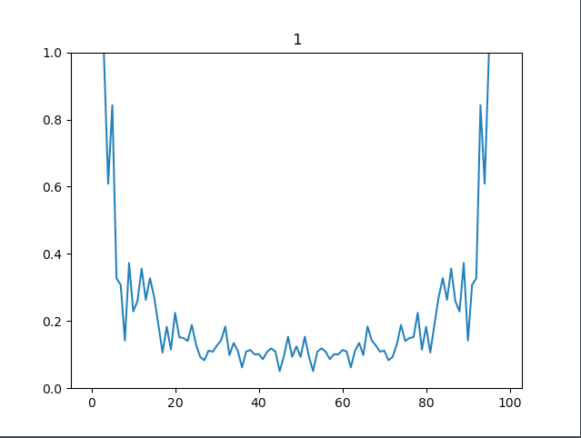
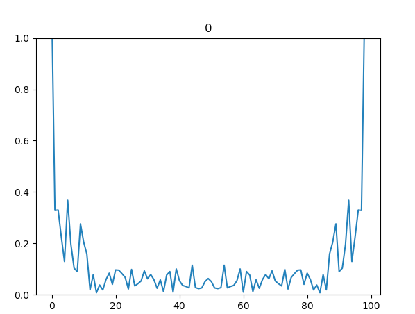

##Notes on parameter tuning:

* 3 sen, 200 ws, random test:
  * .74,.59 ; .67,.59 ; .75; .67 ; non rem
  * .78,.67 ; .76,.57 ; .77; .68 ; rem 

* 3 sen, 250 ws, random test:
  *  .76,.81 ; .70,.70 ; .74,.75 ; non rem
  *  .80,.74 ; .78,.68 ; .79,.78 ; rem 

* 3 sen, 275 ws, random test:
  *  .74,.76 ; .68,.75 ; .76,.72 ;non rem
  *  .78,.77 ; .76,.83 ; .75,.78 ;rem 

* 3 sen, 300 ws, random test:
  * .72,.78 ; .66,.77 ; .76,.67  ; non rem
  * .74,.72 ; .73,.72 ; .77,.74  ;rem 

## Notes on model performance:

* removed the limit on fff 
  [2-12 dims tried, 2 sensors]:
    * svc: 9,.65
    * knn: 3, .57
    * rfc: 2, .49

* How does FFT of each label look?
  * The below excluded the first point of fft, otherwise not sym.
      * 
      * 

  